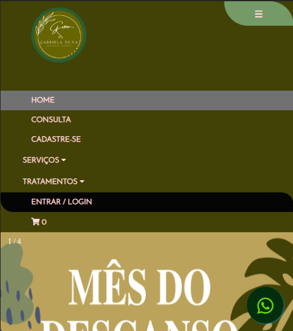

# Gs-Estetica-Projeto-Final

Projeto final do Curso Front End do Senai-DF, Turno Noturno !

Objetivo Fazer um site para uma Clinica de Estética e Harmonização Facial.

Professora: Adriana Falcomer Pontes.

Mostrando o Que Aprendi Durante o Curso.
Ainda tenho muito há Merolhar.

### Os Requisitos usados no Projeto Foram:

* [HTML básico](https://www.w3schools.com/html/)
* [CSS básico](https://developer.mozilla.org/pt-BR/docs/Web/CSS)
* [JS básico](https://www.w3schools.com/js/)

Url do Projeto.

https://bruiinsilva.github.io/Gs-Estetica-Projeto-Final/index.html

 Algumas Fotos do Site.
 
 =======
 Navegação

=======

=======
 Rodapé

=======

=======
Responsivo  

=======
